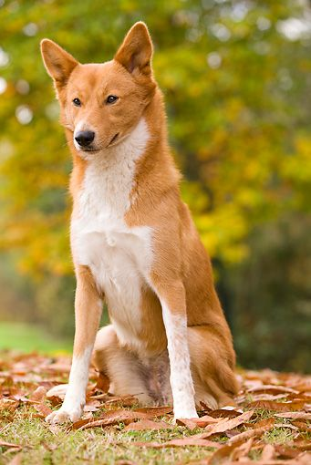
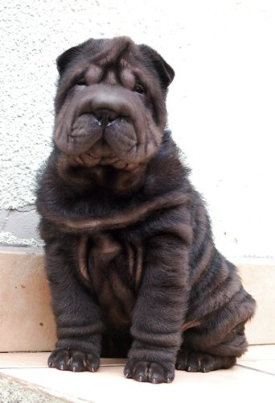
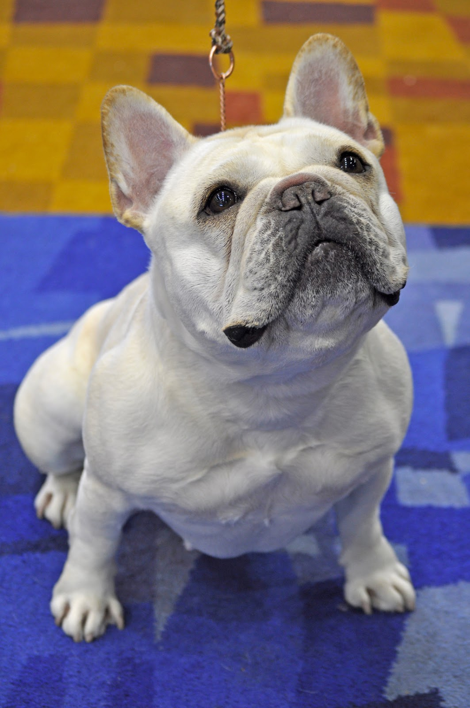

[//]: # (Image References)

[image1]: ./images/sample_dog_output.png "Sample Output1"
[image2]: ./images/Welsh_springer_spaniel_08203.jpg "Sample Output2"

## Project Overview

Welcome to the Convolutional Neural Networks (CNN) project in Udacity's DeepLearning Nanodegree! At the end of this project, the code will accept any user-supplied image as input. If a dog is detected in the image, it will provide an estimate of the dog's breed. If a human is detected, it will provide an estimate of the dog breed that is most resembling. The image below displays potential sample output of your finished project.

![Sample Output1][image1]

## The Road Ahead

We break the notebook into separate steps:

* Import Datasets
* Detect Humans
* Detect Dogs
* Create a CNN to Classify Dog Breeds (from Scratch)
* Create a CNN to Classify Dog Breeds (using Transfer Learning)
* Test the Algorithm

## Some Interesting Results:

- Final Model's Test Accuracy: 76% (641/836 images).

This dog's breed is: Welsh springer spaniel

 

Hello, Human! If you were a dog, you would look like: Canaan dog

 

Hello, Human! If you were a dog, you would look like: Chinese shar-pei

 
Hello, Human! If you were a dog, you would look like: French Bulldog

 

Hello, Human! If you were a dog, you would look like: Dogue de bordeaux

## For more details

Visit the detailed Jupyter Notebook: [dog_app.ipynb](dog_app.ipynb)
